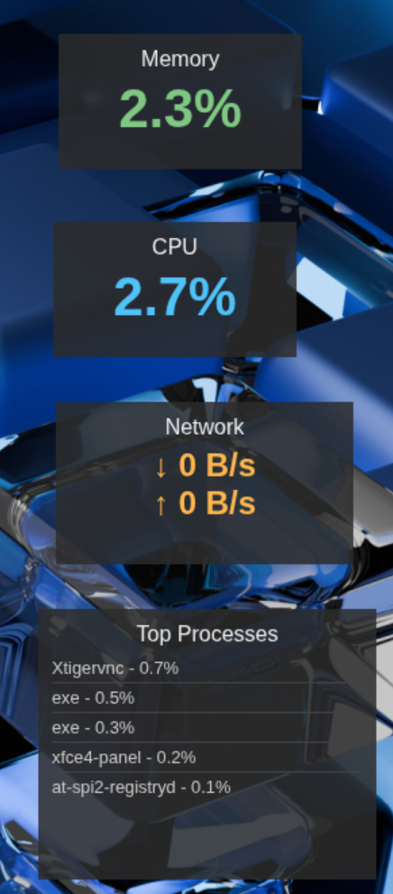

# DevDash

A sleek, modular, and customizable system monitoring widget application built with Electron. DevDash provides real-time at-a-glance views of your system's core statistics, allowing you to position widgets anywhere on your screen.



## Features

- **Modular Widgets:** Display only the information you need. Each widget is an independent window.
- **Real-Time Monitoring:** Get live data on CPU, Memory, Network, and running processes.
- **Customizable Layout:** Drag and drop widgets to arrange them perfectly on your desktop.
- **System Tray Integration:** Control widget visibility from a convenient system tray menu.
- **Lightweight & Clean:** Built with performance and a minimal aesthetic in mind. Widgets are semi-transparent and stay on top of other windows.
- **Cross-Platform:** Works on Windows, macOS, and Linux.

## Widgets

- **CPU:** Displays current total CPU usage.
- **Memory:** Shows current RAM usage as a percentage of total memory.
- **Network:** Shows real-time download (↓) and upload (↑) speeds.
- **Processes:** Lists the top 5 processes currently consuming the most CPU.

## Installation & Setup

To run this project from source, you'll need to have [Node.js](https://nodejs.org/) and npm installed.

1. **Clone the repository:**

    ```bash
    git clone https://github.com/blackbat13/devdash.git
    cd devdash
    ```

2. **Install dependencies:**

    ```bash
    npm install
    ```

3. **Run the application:**

    ```bash
    npm start
    ```

The widgets will appear on your screen. A system tray icon will also be created for managing them.

## Packaging the Application

You can package DevDash into a standalone executable for your operating system.

1. **Install the packaging tool:**

    ```bash
    npm install --save-dev electron-packager
    ```

2. **Run the packaging script:**
    - **For Windows:**

        ```bash
        npm run pack-win
        ```

    - **For macOS:**

        ```bash
        npm run pack-mac
        ```

    - **For Linux:**

        ```bash
        npm run pack-linux
        ```

The packaged application will be found in the `/dist` folder.

## Project Structure

The project is organized into a modular structure for easy maintenance and extension.

```txt
devdash/
├── assets/             # Icons and other static assets
├── src/                # Main application logic
│   └── main.js         # Electron main process (controls windows)
├── widgets/            # Widget-specific files
│   ├── widget-*.html   # HTML templates for each widget
│   ├── renderer-*.js   # JS logic for each widget
│   └── widget-style.css # Shared stylesheet for all widgets
├── package.json        # Project metadata and scripts
└── README.md           # This file
```

## Adding a New Widget

The widget system is designed to be easily extensible. To add a new widget:

1. **Create HTML and JS files** in the `widgets/` directory, following the naming convention (`widget-name.html`, `renderer-name.js`).
2. **Link the stylesheet** in your new HTML file: `<link rel="stylesheet" href="widget-style.css">`.
3. **Update `src/main.js`:**
    - Add your new widget to the `windows` object.
    - Add a `createWidget()` call for it inside the `createAllWidgets()` function.
    - Add a menu item in the `updateTrayMenu()` function.

## Built With

- [Electron](https://www.electronjs.org/) - Cross-platform desktop application framework
- [Node.js](https://nodejs.org/) - JavaScript runtime
- [systeminformation](https://github.com/sebhildebrandt/systeminformation) - System information library

## Contributing

Contributions are what make the open-source community such an amazing place to learn, inspire, and create. Any contributions you make are **greatly appreciated**.

If you have a suggestion that would make this better, please fork the repo and create a pull request. You can also simply open an issue with the tag "enhancement".

1. Fork the Project
2. Create your Feature Branch (`git checkout -b feature/AmazingFeature`)
3. Commit your Changes (`git commit -m 'Add some AmazingFeature'`)
4. Push to the Branch (`git push origin feature/AmazingFeature`)
5. Open a Pull Request

## License

Distributed under the MIT License. See `LICENSE` for more information.

## Acknowledgements

A huge thanks to the creators and maintainers of Electron and the vast open-source ecosystem that makes projects like this possible.
